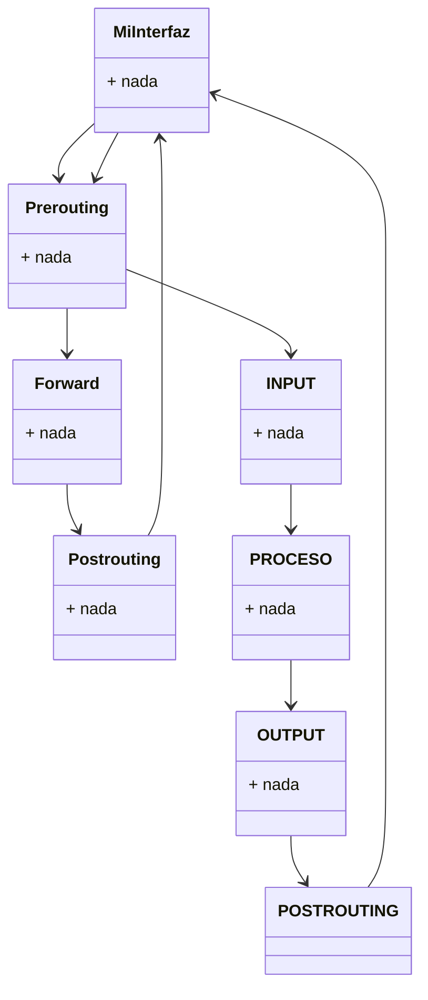

# Temario LSI (2023-2024)
## Siglas
- **MD5/SHA/SHA3** : Es una funcion hash que puedes aplicarla sobre algo(un PDF) y te devuelve una huella digital(cadena) que es el resumen.
                     No es un algoritmo criptográfico
- **AES/chacha** : Algoritmos criptograficos que cifran la informacion para evitar que te la roben.
- **Firma Digital** : Darle validez legal a un PDF, documento o sesión tráfico de red. En los certificados digitales se cifra la clave privada 
                      para evitar que te suplanten.
- **Clave privada** : Cifrar
- **Clave publica** : Descrifrar 
- **NTP(Network Time Protocol)**: Es el que pone en hora todo.
- **VPN(Virtual Private Network)**: El trafico va cifrado y autenticado desde mi pc hasta la máquina(a traves del servidor de UDC).
- **Intranet** : Red donde estan las BD.
- **SMTP** : Protocolo de correo electronico.
- **GNS3** : Simulador de redes (no emula).
- **PacketTracer** : Emulador de Red (Creo ??)
- **NAT(Network Adress Translate)**: Tus dispositivos estan en una intranet(red privada).
- **DHCP** : configurar las maquinas de manera dinamica(asigna las IP a cada maquina de una intranet).
- **CVE(Common vulnerable exponse)** : Lista de todo tipo de vulnerabilidades de todo tipo de plataformas.
- **NVD(National Vulnerable Database)** : Base de datos de vulnerabilidades.
- **CVE(Common Vulnerabilities and Exposures)** : Lista de vulnerabilidades de ciberseguridad conocidas publicamente.
- **CWE (Common Weakness Exposure)** : Tipologias de vulnerabilidades
- **CVSS(Common Vulnerability Score System)** : Sistema de puntuacion para clasificar las vulnerabilidades.
- **CPE(Common Platform Emmeration)** : Tipos de plataformas (Versiones de Debian, para clasificar plataformas)
- **OVAL OPEN (Vulnerability and assessment language)** : Aparece ya que **CVE**, 
  **CWE**, **CVSS** tenian problemas a la hora de establecer los campos.  
- **NDP** : Protocolo equivalente a ARP pero en IPv6.
- **Maltego** : Herramiento para la ingenieria social.
- **Netglub** : Igual que Maltego
### Orden para cifrar un PDF
- **PDF** -> **HASH** -> **Huella** -> **Cifrar** -> **Huella digital**
## Tema 1: Fundamentos y Categorias de ataques
### Vulnerabilidad
Las hay de Software y Hardware. Se les reconoce por una sigla llamada **CVE** y **CVSS**.  
Ejemplo : CVE-2013-3527  
Para atacarlas se utilizan los **exploits** (te dicen como atacarlas, cosa que el **CVE** y **CVSS** no te dice)  
#### Tipos
- **Zero-Day** : Vulnerabilidad encontrada no parcheada, que puede ser utilizada para un posible ataque.  
  Se le asigna un **CWE** y **CVE**.Los hay sin **CWE** y **CVE** por que no interesa en algunos casos.
- **Zerodium** : Intermediario entre empresa y hackers para hacer negocio.
### Amenazas
Se les reconoce por una sigla llamada **CWE**.  
Ejemplo : CWE-89 nvd.mst gov/vdn
#### Tipos
- **Backdoor** : Puerta trasera que sirve de acceso a un compañero.
- **Sniffer** : Captar trafico de la red.
- **Malware/Virus** : Software maligno, que hace cosas que debe hacer pero otras a
  mayores por detras (MDA SSA256)
- **BOT** : Sistema o infraestructura que esta a servicio de un tercero.
  Ordenadores, telefonos moviles, neveras, teles.  
  Cualquier cosa que tenga connectividad.
- **KeyLoggers** : Dispositivo que registra claves.
- **Worm** : Gusano 
- **Spyware** : Recopila informacion de tu PC y las transmite a otro sitio sin que te enteres
- **Rootkits** : Le da al hacker la capacidad de meterse en tu movil y controlarlo
- **Reverse Trojan** : roba datos privados bajo un comando hacker
- **Trojan Horse** : Caballo de Troya, malware que se descarga en tu PC finjiemdo ser un programa legitimo
### Ataques
Aprovechan una vulnerabilidad para conseguir algo a cambio.
#### Tipos
 - **[D]Dos** : Los hay por **UDP**(aunque pierda paquetes no pasa nada)
                y **TCP**(info cortada al perder paquetes). 
 - **Fuerza Bruta** 
 - **Poisoning** : Envenenar la red para hacer creer a la red que formo parte de ella 
 - **Inyection Web** : Permite recuperar cookies 
 - **Incidente** : Evento que produce un fallo de servicio(lo que paso el lunes) 
                   tipos: internos,externos,accidentales y no accidentales(son ataques)
 - **BotNet** : Ataques que se hacen por inundacion
### Virus 
#### Tipos
- **Troyano** : Códigos maliciosos que intentan mostrarse como algo útil o apetecible para que un usuario lo ejecute.   
  Backdoors (codigo maligno que se hace pasar por un software venigno, troyano de puerta trasera) es un programa que el atacante instala en un sistema para permitir el acceso.
- **Gusano** : Software que se expande. Wanacrey
- **Dropper** : Virus + Gusano
- **Propagacion**  : Gusano y Dropper
- **Ocultacion** : Dropper y Troyano
### Lo que compone Internet
- **Google** : (5% de internet)
- **Deepweb** : Trozo de internet que no esta indexado 
- **Darkweb** : Donde se venda drogas,armas,familias (1% de internet)
- **Datango** : navegador que no te tracea (es a parte)

### Diferencia entre Modelo TCP/IP y OSI
#### Modelo TCP/IP  
  **4** Aplicación  ---> 7,6,5  
  **3** Transporte  ---> 4   
  **2** Internet/red --> 3  
  **1** Acceso ---> 1,2
#### Modelo OSI
  **7** Aplicacion   
  **6** Presentacion  
  **5** Sesión   
  **4** Transporte   
  **3** Red  
  **2** Enlace   
  **1** Fisica  

- **Phisjing** : Aplicacion o sesion o presentacion
- **Spoofing** : 2. a la 5. 
- **Shifing**  : 3  a la 7.
- **fisica** : 3 a la 7.

### Categorias de Ataques 
- Se basan en este esquema: **Origen** -> **Flujo** -> **Destino** 
#### Interrupción 
Que un servicio deje de funcionar o funcione mal
##### Tipos
- **Dos** : Ataque de sistema sobre sistema. Siempre por inundacion
- **[D]Dos** : Varios Sistemas atacan a un solo sistema. Ejemplo : BotNet
- **Ataque de Negacion de servicio de tipo logico** : Se resulve con un parche, ya que usan las vulnerabilidades para atacar  
- **Ataque de Negacion de servicio por Inundacion** : Mas dificil de proteger, ya que hay que saber el tipo de trafico que es dañino y el que no.
Una solucion es hacer gestion de ancho de banda de las maquinas (esto se hace con **iptables -hashlimit**)  
Ejemplos : **Traffic Shapinc**(forma de gestionar la calidad del servicio) y **QoS**(buscar la calidad)
- Tambien pueden ser **accidentales** o **a propósito**
#### Intercepcion
- Ataque contra la integridad, ya que se busca obtener informacion pero no modificar nada
- Pirateo de Software, sniffing de datos (sin modificacion)
#### Detección
Importante para evitar problemas
##### Tipos
- **IDS** : Detectar posibles ataques e intrusiones en el sistema
- **IPS** : Deteccion y prevención de posibles ataques e intrusiones en el sistema  
  Ejemplos: **SNORT**, **SURICATA**.  
  En un principio se colocaban los IPS en los putnso críticos de la red (la entrada), pero se paso a poner IPS
  en distintos puntos de una red.     
  Ante un problema hay que acotar el problema de manera que sepanos si el problema lo tiene el flujo o el destino.  
  Una vez que detectas el problema(**IDS**) lo solucionas (**IPS**)
- **Sensores**
- **Sistemas de deteccion basados en Red** : Se monta en un punto de la red donde hay mucho trafico
  Ejemplo : Ataques
- **Sistemas de deteccion basados en Host** : Analiza la informacion del logs de los hosts
- **Fallos de los Sistemas Operativos y las Aplicaciones**
- ERTMS : Sistemas de gestion de lineas de ferrocarril (INFO A MAYORES)
#### Modificación
- Ataque contra la **integridad** (Funcion hash para evitar estos ataques)  
  Ej: Modificar una **BD** (mediante ataques sql), modificacion de programas(crackers), malware,  
  troyanos, modificar elementos hardware, modificar sesiones, desbordamiento de pila, hacer MITM, desbordamientos de pila...
#### Spoofing
- Suplantar cosas : **IP4** direcciones(32 bits) **IP6**(direcciones de 128 bits) **MAC**(direcciones de 48 bits)  
  Para hacer spoofing con correo (netstat [ip] [puerto]).  
  Ejemplos: **SMSFake**(de pago), **SPoofcar**(llamadas telefonicas), **FakeNameGenerator**      
#### Generación/Fabricación
- Ataque contra **Auntenticidad**    
Ej: Intentar falsear cache, infecciones de malware, DNS Spoofing contra caches , HPING3, SCAPY, packit, añadir transacciones falsas a internet...  
Herramientas para inyectar paquetes : hping3, scapy, packit  
#### Amenazas
- Mirar el **PDF de Adrian**
#### Mas cosas
- **Gnat** : 
- **Proxy** : Maquina en la que los host de mi red se conectan si quieren acceder a internet.  
  Esto se usa para evitar que mis maquinas se conecten a cualquier, inundaciones,etc...  
  El problema es que con un proxy cortas conexiones de tu organizacion, que son conexiones legales.   
  Debido a que del proxy sale una unica IP que es usada por cualquier maquina que quiera acceder a internet.     
  Ejemplo : squid, apache
- **Redundancia** : Se hace por seguridad. Se suelen redundar las comunicaciones.   
  En el caso de caer la fibra optica por autopista es bueno tener otro camino de fibra.
## Tema 1.2:  Information Gathering (Recoleccion de Información)
### Host Discovery
- Descubrir un host(**servidores DNS**, **web** y **email** los mas faciles de encontrar. Si es en intranet es mas dificil)
#### Comandos
- nmap **-sP** 10.11.48.0/24 : Nos hace un hostdicovery(si nos responde es que hay maquina). Envia paquetes TCP/ICMP
- Con **-sL** : Lista todos los equipos de la red. No envía paquetes
- Con **-PS [lista de puertos]** : ping TCP SYN
- Con **-PA [lista de puertos]** : ping TCP ACK
- Con **-PU [lista de puertos]** : ping UDP
- Con **-PE** : Solicitud de echo
- Con **-PP** : Consulta de marca de tiempo
- Con **-PM** : Consulta de máscara de red
- Con **-PN** (skip ping): Escaneo de las maquinas cuando falla en Host Discovery.
- Con **-n** (No realizar resolución DNS inversa)
- Con **-R** (Realizar resolución de nombres con todos los objetivos)
### Port Scanning
- Escogi masquinas y **escaneo puertos** para saber cuales estan levantados y cuales no.
#### Estado de los puertos
- **open** : abierto   
- **closed** : cerrado pero hay algo    
- **filtered** : filtro que te impide llegar a ese puerto  
- **unfiltered** : no esta filtrado pero no es capaz de determniar si esta abierto o cerrado   
- **open filtered** : no sabe si esta filtrado o abierto  
- **close filtered** : no sabe si esta filtrado o cerrado
#### Comandos
- **IDLE SCAN** : nmap **-l0** **-p** 80 -s | x.x.x.x  www.loquesea     
                  **-l0** --> que no haga host dicovery    
                  **-s** --> maquina zombie                         
- **ip id +1** = el puerto esta cerrado  
- **ip id -2** = el puerto esta abierto  
Hay que saber que maquina es la zombie(hay que ver que tenga kernels con ip ids secuenciales)   
fw con control de estado esta se caeria al seguir control del estado de las conexiones.
En internet hay mas fw sin control de estado que con control de estado 

- **hping3 -c 1 -s -p 22 [IP]** : Si delvuelve ACK(se inicia la charla) si es reset(esta apagado)
- **nmap -sS -p 22,80,443,512...** : Saber si los puertos estan cerrados(escaneo de puertos)... **(TCP SYN Scan)**
- **nmap -sA-p 22,80,443,512...**  : Escaneo de puertos con ACK **(TCP ACK Scan)**
- **nmap -sT** : Escaneo por defecto que se hace cuando no se puede realizar el SYN Scan **(TCP Connect Scan)**
- **nmap -sU** : Escaneo por UDP **(UDP Scan)**
- **nmap -sI** :  **(TCP Idle Scan)** : Manera sigilosa de saber si un puerto de otra maquina esta abierto, cerrado o filtrado.
- **nmap -sF** : Se fija el flag FIN
- **nmap -sN** : No se fija ningun Flag
- **nmap -sX** : Se fijan los flags FIN,PSH y URG  
Estos tres ultimos tienen que averiguar si un puerto esta cerrado y atravesar FW que no hagan inspección de estado o routers que hagan  
filtrado de paquetes.  

Se envio un ACK Y RECIBO UN RESET SE QUE EN EL MEDIO NO HAY UN FIREWALL DE CONTROL DE ESTADO
pero si no recibo nada puede que si que haya un firewall o la maquina este apagada.
Hay casos donde recibes reset y puede ser que lo envie el firewall, por lo que si recibes reset puede haber firewall 
  
- **nmap -PU 512,123,57...** : Escaneo por udp  
- **nmap -D [IP][IP][IP][IP]** : Escaneo de **IPs** (decoyscan)  
- **nmpa -6 []** : escaneo **IPv6**  
- **nmap -T 0** : las peticiones se envian seguidos(no es bueno si se envian muchos paquetes a la vez)  
- **nbtscan** : escaner pero en windows  
- **Descubrir/investigar maquinas** : Si trazo una ruta a un servidor web, la ultima IP es posible que sea la del firewall de la organizacion.  
  Podemos usar "traceroute" para llegar al servidor web   
- **traceroute -T -U [IP]** : Paquete sync por TCP (llega seguro al servidor web)
### Fingerprinting
- Técnicas para determinar que SO y version tiene la maquina. Este se aplica al **PORT SCANNING** ya que al saber un puerto que esta    
  levantado puedo saber lo que esta corriendo ahi y asi descubrir vulnerabilidades.  
  Hacer **port scanning** --> **fingerprinting** activo    
  buscar info ---> **fingerprinting** pasivo
#### Comandos
- **nmap -O [IP]** : que SO y version tiene la maquina(fingerprinting del SO y tambien los puertos)  
- **nmap -sP -sV 10.11.48.0/24** : (fingerprinting de servicios y puertos)
- **nmap -A** : te devuelve todo      
### FootPrinting 
- Recolectar info de paginas web, redes sociales(info publica)
### Google Hacking/Dorks 
- Uso de toda la semantica y expresiones para la busqueda de info y asi acceder a infraextructuras
### Fuentes Publicas 
- **JMALTEGO**(CREAS ENTIDADES QUE SON COSAS QUE DESCUBRES(IP,MAQUINAS,PERSONAS),**NETGLUB**
### Osint
- **Open Source Intelligent** (Sirve para coger info publica, procesarla y usarla)
- Open Osint Framework.com : Herramientas OSINT online 
### Net Rangos (Rangos de red)
- PUBLICA (son publicos)  
  **NIC(NETWORK INFORMATION CENTER)** es --> udc (NO HAY INTRANET)  
  El NIC sirve para conocer el direccionamiento publico de organizaciones  
  El direccionamiento de una IntraNet no es publico  
  **RIPE(REDES IPS EUROPEAS)**  
  **NCC(CENTRO EUROPEO)** 
### Payloads
- Son módulos de **metasploid**
#### Términos 
- **Single**      
- **Stargers**     
- **STAGES** : Utlidades(para hacer todo tipo de cosas contra esa maquina que he reventado).  
  Ejemplo: **Meterpreter**(tema de logs).  
- **SET** : Herramienta de ingenieria social.   
- **msfplyaloads** : Te permite hacer playloads para hacer **metasploid**(tema de troyanos).  
- **msfencode** : Ofuscador, reescribir el código de los **playloads** para hacer que sea menos detectable.  
  Estos dos se integraron en msfvenon.
### Capa 7
- **Aplicativo Web**
**WAF** ---> **WEB APPLICATION FIREWAL** (Firewall en capa 7, filtra los posibles ataques a aplicaciones web)
Si montas aplicativos web: **WAF** --> se basa en parar problemas de seguridad  
Ejemplo : **modsecurity**, **cloudfare**,**infogure**    
**Explotación** : Escalado de privilegios y pivoting
### OWASP
- **Open Web Aplication Security Project**      
  Muchas líneas de trabajo: Desarrollo de tecnologias,Metodologias para auditar.  
- **OWASP TOP 10** : Documento pequeño(lectura recomendada para el desarrollo software).  
  Lo editan cada 4 años(el último es de 2021) analiza la seguridad web de internet, y hace un top 10.  
  El **1)** siempre fue "INJECTION", pero eso cambio en 2021.  
  **1) Broken Access Control** : Id inseguros -> Path transversal.  
  **2) CRYPTOGRAPHIC FAILURES** : Malas implmentaciones criptorgraficas.      
  **3) INJECTION** : **Sql** inyection, **LDAP** inyection, **OS** inyection,etc.**XSS**(cross-size scripting)   
  **4) INSECURE DESIGN** :   
  **5) SEC MISCONFIGURATION** : **HTTP** mal formadas, error parches actuales y **XXE** (ataques que van contra aplicativos que utilizan XML y JSON)  
  **6) VULNERABLE AND DU+DATED COMPONENTS**  
  **7) AUTENTICACION**  : Problemas de gestion de sesiones, usuarios y password comprometidas, robo de cookies  
  **8) INTEGRIDAD DE SOFTWARE Y DATOS**  
  **9) TEMAS DE MONITORIZACION Y LOGGING**   
  **10) SERVER SIDE REQUEST FORGERY (SSRP)**              
- **ASUS** : Standar para analizar el nivel de seuguridad de un aplicativo web (APPLICATION SECURITY VERFICATION STANDAR)  
- **ZAP** : Escaner de seguridad de **OWASP**  
#### Comandos
- **wmic process list full** : ps
- **ipconfig /displaydan** :
- **ipconfig /all** : ifconfig -a
- **nc -v -n -w IP 21-180**
### 4º Generación
- **APLICACION(CAPA 7)** : Modificar parametros de la maquina
- Directorio **/proc/syslnet** : aqui dentro hay ficheros que puedo modificar,estos ficheros determinan como se comporta la maquina a nivel de red(UDP y TCP) 
- **OFUSCACION** : **TTL**(valor que se decrementa en 1 cuando se envia un paquete a un destino)  
                 **Windows** = **TTL** DE 128 ---> reg edit  
                 **Linux** = **TTL** DE G4 ---> echo 128 > /proc/sys/net/ipv4/ipdefault_ttl   
#### Más sobre Ofuscación
- **OSfuscate**  
- en /etc/apache/apache2.conf                   
- **ServerTokens**  
- **ServerSysnatune**
- $lynx -head -dmap http://www.usc.es : informacion del servidor web(lo que tiene montado)   
- Para hacer **portscanning** ---> usar nmap  
- **whatweb**  
- **SMNTP** (Verified(Desactivado) Respt to(El destinatatio)) : se puede hacer a mano con netcat. Sino usar smtp-move-daemon -M VRFY/REPT -U -T servirtol      
### Firewalls
#### Comandos para configurar Firewalls  
- **iptables**  : iptables -t MANGLE -I OUTPUT -j TTL -ttl -set 53  
- **nft**
#### Tipos
- **Firewall sin control de estado** : Funciona en capa 2   
- **Firewall con control de estado** : A mayores comprueba el estado de todas las conexiones que se hacen(siguiendo los hand sakes). Se envian los acks           
- **Firewalls modo router** : Router donde hago routung y defino listas de acceso(que IP`s dejo pasar) para filtrar  
- **Firewalls NAT** : Router donde hago routing y nating  
- **Firewalls modo transparentes** : Trabajan en capa 2 (sus interfaces no tienen IP). La gente de fuera de la red local no lo ve  
  ya que es de capa 2 y no se puede hacer routing para llegar a el.  
  mtables(montar firewall en capa 2, lo opuesto a iptables) www.nslap.com  
- **Firewalls de nueva generacion** : Desde capa 2 a 7(los mas potentes)
#### Como saltarse un Firewall (con control de estado y sin el)
- **#ssh X.X.X.Casa -p 443 -l user -L 2128:X.X.X.JUEGO:Puerto** : **CASA** es un servidor ssh con su fichero de configuracion(/etc/sshd.conf poner port: 443)   
El primer 2128 es el puerto de mi maquina con el que hago LOCALHOST y el segundo es el puerto de JUEGO. JUEGO es la maquina a la que quiero acceder.   
Si hacemos un http//:LOCALHOST:3128 Para ir desde mi maquina CASA voy desde un puerto al 443   
### Más cosas a mayores
- **Information gallery** : MALTEGO, NETGLUB
- **Metadatos** : CREEPY(recolecta fotos y geolocaliza el lugar donde se han hecho a traves de metadatos)
- **SPIDER** : engancharse a servidores web de internet(donde hay un idex.html). Recorre el arbol web empezando por el index.html de servidor en servidor. 
- **CRAWLER** : Lo mismo que el spidering pero ademas busca la vulnerablidades/y hace un analisis sintactico) de los servidores
- **SCRAPPER** : Coger informacion de varios sitios para comparar "precios"/cosas.
- **HARDENING** : endurecer nuestro sistema para mejorar la seguridad 
               Herramienta: lynis audit system (te da consejos para mejorar la seguridad de tu maquina)    
               Libreria: lilpum-tmpdir    
- **atp-listbugs** : Permite ver los bugs de los paquetes   
- **apt install needstart** : Se usa cuando hay cambios de librerias
- **debsecan** : te da las vulnerabilidades no parcheadas de tu maquina    
- **debsums -d** : Te dice las diferencias de cada paquete instalado  
- **fail2ban** : ataques password-guessing los evita.   
- **systemd-analize security apache2.service** : Analisis del nivel de seguridad (las directivas que aparecen en el .service)   
- Protect.system:full   
- **sandbox** : Entorno acotado(donde se corre un servicio con sus librerias, de manera que si acceden a ese servicio no afecta al resto de servicios). Write-only patch    
- **etc/security/limits.conf** : Puedo establecer limites a ciertas cosas(RAM,Disco,Pila,CPU). Se hace modificando las variables    
- **fichero core** : Volcado de memoria(imagen del SO). En casos de errores       
- **Mayor redundancia** -> Mayor seguridad  
- **PAE**(**PHYSICAL ADDRESS EXTENSION**) : permite ampliar la RAM de nuestros sistema (pasar de 4GB a 64GB)  
- **DEP**(**DATA EXECUTION PREVENTION** (otro nombre: no execute)): las zonas dedicadas a datos(la pila), el sistema las controla como de no ejecucion  
- **/etc/pam.d/common-password** : Donde podemos modificar parametros. Si ponemos ramds=20000 en el fichero, la contraseña que ponemos al entrar se le aplicara la funcion hash 20000 veces.  
Con esto se hace mas dificil crackear los passwords.  
- **/etc/shadow** : se almacena el hash y el password de todos los usuarios. Cuando te autentifica la passord que poner se le aplica hash y si esa password  
coincide con la que esta alamcenada en shadow te deja entrar. 
- **chage -lsi** : para ese usuario la fecha actual, cuando cambie la contraseña,etc...  
- **passwd -e lsi** : hace que expire la contraseña de este usuario  
#### Librerias que hacen como deben ser la passwords(tema caracteres, anchuras, que no repitas contraseñas) 
- pam-cracklib
- pam-passwdqc 
- pwquality

- **Umask 022** : los ficheros creados tendran como permisos rwxw-xx-x (usa profile)
- **Umask 027** : el fichero credado tiene como permisos rwx r-x--- (usa bashrc)
- **/etc/profile** : (Generico para todos los usuarios)aqui puedo modifcar el umask)
- **$home/.profile** : (Para cada usuario especifico)
- **/etc/bash.bashrc**
- **$home/.bashrc**
- **LVM** : **Gestion Virtual de dispositivos de alamacenamiento**    
Permite aumentar/reducir las particiones de la máquina(buscando espacio de otra partición)  
- echo 1 > /etc/sys/kernel/modules-disabled  
- /etc/modprofile.d/blacklist.conf : Te mira reducir las sesiones, el numero de intentos de contraseñas  
## Tema 1.3:  Ocultación 
### NAT
Usando **NAT** no hay ocultación    
Si yo accedo a un servidor web a traves de **NAT**, ese servidor con sripting puede conocer mi ip. Por ello Hay que trabajar la ocultacion en todos los niveles de la **capa OSI**.  
La clave es cambiar la **MAC** ya que cambiar la **IP** no es tan seguro si tienes la misma MAC siempre.
### PROXY
REMOTE_ADDR : IP(X) IP(X) IP : solo se vera la ip del ultimo proxy   
X_FORWARDED_FORI : IP,IP
#### TIPOS
- **PROXYS HTTP**
- **PROXYS SOCK**
- **PROXYS TRANSPARENTE** : No da ocultacion ni privacidad (HTTP FORWARDING FOR)
- **PROXYS ANONIMMOS**  
- **PROXYS ANONIMICIDAD**  
- **PROXYS RUIDOSOS** : En las cabeceras meten ruido(direcciones falsas)
##### PROXY HTTP
- **export http_proxy=http://x.x.x.x:3128**  : hago de proxy de las peticiones http
- **export ftp_proxy=ftp://x.x.x.x:3128**  : hago proxy de las peticiones ftp
- **software para montar un proxy http** : squid
- **/etc/profile** : proxy HTTP      
- **$''/profile** : proxy HTTP
##### PROXY SOCK
- etc/socks.conf
- direct 127.0.0.1 255.255.255.255
- direct 10.11.48.0 255.255.254.0 
- sockd @:x.x.x.x  0.0.0.0  0.0.0.0 
## Tema 1.4:  Sniffing y más
### AIRMON
- **airmon -ng** : Tarjeta WI-FI "modo monitor" -- esnifas todo el trafico en el aire(que es el medio del WI-FI)   
- **airondump -ng** : Captura trafico  
- **aireplay -ng** : Enviar paquetes de auntentucacion(a una maquina) y quitarte la autenticacion de la wifi  
- **aircrack -ng** : Crackeador de HANDSHAKES (WPA2)  
- **airmon -ng start wlan0** : Modo monitor la tarjeta wlan0  
- **airondump -ng mon0** : El mon0 es el lugar donde capturo trafico de la wlan0.  
  Muestra: BSSID (mac del pubto de acceso) , ESSID (nombre de la wifi, maquinas conectadas a ese punto de acceso)  
- **airondumo -ng --CANAL -bssid [punto de acceso] -w captura mon0** : Pilla eñ trafico de y lo alamacena en el fichero "captura"  
- **airplay -ng -0 1 -a XXXXX -c xxxxx mon0** : Asi le le quito la auntenticacion  
- **aircrack -ng -w disc captura** : Le crackeo(me calcula PNK`s)  
### PROCESO DE CRACKEO CON WPA2 A UNA WIFI PTK: PNK ANNOUNCE SNOUNS MAC(PUNTO DE ACCCESO) MAC (DE LA ESTACION)
El PNK de la clave de acceso(password)
Si todo lo que metes del PTK coincide con ese NICK del password -> YA ESTARIA  
- **WPS** : Se usaba hace años. Estandard en el que habia un indentificador(QR) para conectarse mas facil a la WIFI  
El identificador tenia 7 digitos decimales. Cuando se programo el WPS se hizo 10^4 + 10^3 en vez de 10^7,  
Por lo que disminuyo el numero de convinaciones posibles(la gente robaba el WI-FI)  
- **FLUXION** ---> Herramienta de Ingeniera Social(Suplanta un punto de acceso)
### HERRAMIENTA DE CRACKEO DE HASH
- **hashcat** : soporta como 200 hashes
- **CAIN&ABEL**
- **john**     
- **unshadow /etc/passwd /etc/shadow fichero**
  **/etc/shadow** (aparecen los usuarios)  
  $numero$ : --> **funcion hash** que utilizamos para la password  
  $numero$ : [8 y 16 SALT] [12 a 64 password hasheado y salteado]    
  **HASH:SHA512(PASSW + SALT) + SALT**   

- **SHA512** : funcion hash que devuelve una huella    
- **CEWL** : genera un diccionario  a partir de los terminos de una web (usando spidering)   
- **mutator**  
- **chunk**  
- **thehandnoster**  
- **hashat**
- **Herramienta** : hash_identifice (le das un hash y te dice la funcion con la que fue hasheada) y el hash_id          
- **findmyhash** : te busca en una BD si ese hash ha sido roto o no  
### PASSWORD GUESSING
- Van contra los servicios imperativos de autenticacion(ssh). Son lentos, por lo que se dejan un tiempo ahi para pillar password.  
  Dejan registros en los logs.
- **Filtros** : por **IP**, por usuario (Ataques de denegacion de servicio).  
  Puedo poner el retardo (n-1) segundos.  
#### Comandos
-  **Medusa, n-crack, hydra**
-  **medusa -b** : todos los modulos que contempla medusa para atacar
-  **medusa -m ssh -q** : las opciones para ssh
-  **medusa -h 10.11.48.X -u lsi -P p.txt -M ssh -f -U fichero.txt**  
#### Solución a este tipo de ataques
- Denegar el **ssh** o filtrar a nivel de **Wrappers** y firewalls(puedo meter reglas hash-limit,para limitar los intentos).    
**Fail2ban**, **OSSEC**(ES UN **HIPS**, detecta y evita ataques **PASSWORD GUESSING**), **HIPS(Host Intrusion Prevention System)**
- **CAPTACHAS** : Evitar ataques de PASSWORD GUESSING (Ej: selecciona los fotos donde sale un semaforo)
- **wget -v -k http://www...** : Usar spidering para descargar el index.html
- **wget -v -k -H http://www...**: Usar spidering
### COMO PROTEGER EL GRUB
- grub.mkpasswd-pbkdf2 : Esto te genera un hash(que esta dentro)  
- /etc/grubd/40_custom   
 set superuser=root  
 passwd-pbkdf2 root [hash]
- update-grub --> actualizar el grub   
### REBALLING 
- Tema de graficas
### REFLOW
### 2017 KRACK ATTACK 
- Ataque dificil de implementar(puento de acceso falso).De manera que el punto de acceso falso esta en el medio  
  y tras la 4º conexion tiran y obligan a reinstalar la clave.  
### 2018 WPA3      
### De WPA2 a WPA3
- Longitud de clave : 128 --> 192  
- EL crackeo de **WPA2** a un wifi en **WPA3** no funciona( y el KRACK ATTACK tampoco)
#### Solución
- **#dd if=/dev/userdom  f=/dev/sdb** --> cambia de manera aletatoria estos fucheros
- **#sfill**  : me borra de forma segura en espacio libre
- **#sswap** : me borra de forma segura la parte swap de mi disco duro 
- **#smem** : me hace borrado seguro de la RAM de mi sistema
- **#history** : registros de los comandos que has puesto en la maquina  
DNS LEAKS

### REDES DE ANONIMATO Y PRIVACIDAD 
#### TOR 
- Red en la que para acceder de una maquina a otra hay por el medio nodos(de entrada,salida e intermedios)
- Directorios: donde estan los **"nodos tor"** en cuestion. Esto(el **tor**) te monta un **ONION PROXY**, que adapta la paqueteria a la forma de la red.    
Este proxy cifra la info tantas veces como nodos haya hasta el destino. De manera que el unico nodo que conoce el origen es el nodo de entrada.  
Una vez que llega al destino se quita cada capa. El ultimo de ida y el primero de vuelta se cifran con **HTTPS** para evitar **sniffing** y **envenenamientos**,  
ya que ese nodo conoce mas informacion.
- **Servicios ocultos** : donde podemos utilizar la propia red tor para meterlos(servidor web por ejemplo). **http:// ```````.onion**
- **Problemas de Rendimiento(congestion)** : poco ancho de banda y  mucha latencia. En la ultima version aumentaron los buffers de lo nodos como solucion.
- Algoritmos : **TOR VEGAS** 
- **ATM : Asinconus Trasmision Mode** : Tecnologia de multiconexion de manera que aumentamos el ancho de banda y bajamos la latencia. Podria ser una solucion a las redes TOR                               
- **FAILs** : te da maquinas virtuales 
- **Whonis** :                                    
- **Encadenar proxys** : **http://proxy.puerto/http://proxy2.puerto/http://**
  Descargar en tor proyect tor browser(mas seguro)
- **FORWARDING DINAMICO** : **ssh -p 443 -fN -D 0.0.0:1080 user@X.X.X.CASA**
### Herramienta corkscrew(junto con el forwardeo de puertos con ssh) 
- Te permite saltarse proxys a nivel HTTP
### PORT KNOCKING 
- Parar servicios y levantarlo cuando me hace falta. Lo levanto o tiro enviandolo ACKs o SYNCs (paquetes) que se filtran por el firewall de mi maquina.
- **/etc/knockd.conf** 
  **[OpenSSH]**  
  **sequence**= 7000,7015,9001  
  **seq_timeout**= 10  
  **tagflags**= 54N  
  **COMMAND** = iptables -A INPUT -s %[% -g ACCEPT:_  ---> systemctl start ssh                      
### WEB KNOCKING 
- Lo mismo pero contra **servidores web**( se envian peticiones http en vez de **SYNCs**) 
## Tema 1.5:  Interceptación
### LAN SWITCH SECURITY WHAT HACKERS KNOW ABOUT YOUR SWITCH SECURITY LAYER 2 CISCO PRESS
Libro que trata sobre los ataques a capa 2. Los ataques a esta capa son devastadores  
La capa 2 se tiene en cuenta menos que las capas 3->7.  
### SNIFFING 
Puedo sniffar trafico seguro o no seguro(**FTP**,**HTTP**). Si es trafico **HTTPS** es trafico cifrado al hacer una **autenticacion BASIC** es mas seguro hacerlo por HTTPS 
para proteger mi password. Tambien sirve para analizar redes.
### SUBNETTING
- **Rendimiento** : Usar Redes switcheadas
- **Ahorro de IPs** : VLANs en donde los enlaces entre "los routers" son trunk ports ---> Protocolo 802.11Q o DTP
- **YERSINIA** : permite hacer ataques en capa 2 (a los protocolos).Tambien ataca STP,DTP,802.1q      
### REDES SWITCHEADAS 
- Cada maquina tiene su ancho de banda propio. No son redes de ancho compartido(como eran las redes de antes, donde las maquinas compartian ancho de banda)
### SWITCH SPOOFING  
- Realizar ataques a **802.11Q** para obtener informacion.  
  **Solucion**: Truckear las tramas
### DOUBLE TAGGING 
- Meter doble etiquetado a las maquinas. Cuando llega al commutador de una maquina se quita el primer etiquetado
### STP 
-**Evita los bucles** : para que los switches se comuniquen se utilizan BPDU (donde se convierte la red en forma de grafo en un arbol sin bucles)
Con **YERSINIA** puedes enviar un BPDU a la red para decir que tu eres el "bridge route". Esto es una manera de atacar
- **ROOT BRIDGE GUARD** ---> puedo filtrar donde puedes aparecer o no apareceer los root bridges
- **BPDU GUARD** --> filtrar los puertos por donde no debe hablar BPDUS
- **yersinia - G** : modo grafico
### ARP SPOOFING 
- Engaño a una serie de maquinas(protocolo ARP) haciendoles creer que tengo otra MAC
### ICMP REDIRECTS 
- Envias un icmp y la maquina a la que se lo envias te usa como router
#### Comandos
- **ettercap -M icmp:MAC /IP// /IP//**
- **/proc/sys/net/ipv4/conf/all/accept_redirect** : Si esto esta a 1 es que acepto estos ICMP
- **/send_redirect** : si esta a 1 es que puedo enivar **ICMP**     
- **/service_redirect**    
 - **Mejor opcion** : Modificar el /etc/sysctl.conf (net.ipv4.conf.all.accept_redirect = 0) 
### DHCP SPOOFING  
#### Comandos
- ettercap -Tq -M dhcp:10.11.48.10-25,31/255.255.255.0  //  DNS  / IP //
### DHCP SNOFFING 
- Hace que solo se acepten paquetes dhcp en un determinado puerto(el que yo digo). Si se hace desde otro puerto este se tira  
- Para evitar estos ataques se desactiva el dhcp en las maquinas                  
### PORT STEALING 
- Tengo mi commutador funcionando. Envio a un puerto un monton de paquetes con MAC origen otra maquina(que tiene otro puerto).De esta manera   
EL commutador recibe esos paquetes y le robo el puerto a esa maquina.  
Despues se lo devuelvo	(AL ROBAR MAC DE LA OTRA MAQUINA OBTENGO SU PUERTO)                   
**ettercap -M remote_tree /IP//**                 
-Con **IPV6** hay que usar ndp(no hay ARP ni BROADCAST)   
### DNS SPOOFING 
- Falsear las resoluciones de los servidores DNS(Usar una IP falsa para fingir ser un servidor)
- **/etc/ettercap/etter.conf**  
ett_conf=0   
ett_uid=0    
- **/etc/ettercap/etter.dns**  
www.google.es A 10.11.48.75  
- **ettercap -Tq -i ens33 -P dns_spoof -P repoison_arp -P repoison_arp -P sslste -P sslstrip -M arp // -M 10.11.48.VICTIMA  ///**
### DNSSec 
- Más seguro. Te da auntenticacion e integridad pero no cifrado. Eso se consigue usando un sistema llamado "DNS KEY", teniendo un par de claves                                                                              publica/privada y se usan hashes 
- **DoT** : (**DNS or TLS**)Poner esto a mayores para hacer el DNSSec mas seguro. Con TLS conseguimos cifrado del DNSSec.                                          
### EVILGRADE 
- Moficar la paqueteria de las actualizaciones 
### Comandos ARP Cache
- **arp -a**
- **arp -b IP** : borrar la IP
- **arp -s IP MAC** : hacer una asociacion fija(para borrarla hay que hacer arp -d)
- **arptables -A input --sourcemac=MAC -j DROP** (todo lo que venga de esta MAC lo droppeo)
- **ip link set d ens33 arp off**
- **ip neigh flush all** : me borra la tabla arp
- **/proc/sys/net/ipv4/neigh/ens33/gc_state_tmp**  
- **/gc_state_time** : frecuencia de checkeo de la CACHE   
- **/gc**
### SNORT
- Sistema de prevencion de inclusion 
- **nast -e** : Barrido de IP MAC, si una IP cambia de MAC te avisa
- **ettercap** (PLUGGING) : -P rand_flood : petar el commutador de la maquina  
Como me protejo : UNICAST FLODDING PROTECTION : revisa la velocidad de flujo de paquetes   
          
### PORT SECURITY 
- Definir restricciones de MACs
- **int drop 0/2** : Se me bloquea un puerto y se droppea la paqueteria 
- **switchport port-security mac 4** : Solo me acepta 4 MAC 
- **switchport port-securoity violation protect/restring**                  

### PORT SPAN / MIRRORING
- Si hago un span / mirroring de varios puertos sobre otro puerto(B) todo el trafico de esos puertos se hace "mirroring" a ese puerto(B),  
donde podemos conectar una maquina. Para evitar "cuello de botella" de esta maquina podemos poner un trunk port  
El trunk port tiene otros nombres como: PORT AGGREGATION, LAG , PORT CHANNEL.

### TRUNK PORTS
- **MODE 0** : RR (Row Robin)
- **MODE 1** : ACTIVE-BACKUP
- **MODE 2** : BALANCE XOR -> **(MAC_ORIGEN XOR MAC_DESTINO) MOD Nº DE LA INTERFAZ**
- **MODE 3** : MODO BROADCAST -> Envio de paquetes por todas la interfaces de red
- **MODE 4** : 8025.3ad
- **MODE 5** : BALANCEO DE CARGA DE TRANSMISION ADAPTABLE (balance-tlb) -> Envio el paquete por la interfaz donde haya menos carga

Si vamos al interfaces:  
```
gateway ```` 
sloves ens33 ens34 ens35
bound_mode 0
```
#### Comandos relacionados
- apt i6 infenslove
- echi bounding >> /etc/modules
- module bounding
### TAP
- Son dispositivos hardware que se instala entre el border router y los firewalls(de nueva generacion, que se montan de manera redudante, 1->2) de E/S de tu organizacion.
Si lo apago, el flujo sigue pasando por el pero este deja de sniffar el trafico. Estos firewalls trabajan de capa 2 a capa 7.
### FIREWALLS BUENOS
Los de PALO ALTO (CISCO)
### SIEM
- Trabaja con logs y se alimenta de ellos, un ejemplo es Splunk. SOC esta vinculado al SIEM
### APACHE HADOP
- Framework orientado a la configuracion del software. Este utiliza **HSFS** (Sistemas de ficheros distribuidos). Con MAP REDUCE programas.
### EDR 
- Securiza maquinas finales. Trabaja con agentes y se alimenta de ellos. 
- **NDR** : Se alimentan de los tags de red(trafico) 

en ettercap -P sslstrip --> Solucion : HSTS HTTP STRIP TRANSFER SEC  
### BETTERCAP  
- Es **MITMf** (Man In The Middle Framework)
- Ejemplo : ngrep -d ens33 -x ``  
### SIDEJACKING 
- ROBO DE **COOKIE** AUTENTICATION. Ataques como **SNIFF**,**XSS**...
- **COOKIES** : Se usan para autenticacion, trazeado, perfilado de configuraciones. Document.cookie (aqui se configura toda la info de la cookie) 
### HTML5 
- Aqui se implementa el WEB STORATION 
- SESSION STORAGE : Solo dura durante la sesion  
- LOCAL STORAGE : Esto perdura en el tiempo
### SUPER COOKIES
- Tecnología de cookies para retener y reproducir las cookies que han sido eliminadas o alteradas manualmente por un usuario.
### ZOMBIE COOKIE
- Fragmento de datos que normalmente que se utiliza para rastrear a los usuarios, que es creado por un servidor web mientras un usuario navega por un sitio web.
### EVERCOOKIE 
- Implementacion de cookies persistentes (Ejemplo HSTS, que asegura que el tráfico se realiza mediante un canal seguro)
## Tema 1.6: INTERRUPCION (DENEGACION DE SERVICIO)
### DDos 
- **DENEGACION DE SERVICIO DISTRIBUIDA**
- Ejemplo : **BOTNET**  
- **Dos** : DENEGACION DE SERVICIO
#### ATAQUES 
-**LOGICOS** : Ataque que se hace a una determinada vulnerabilidad para tirar un servicio (SOLUCION : PARCHEAR)  
-**INUNDACION** : Se te abren muchas conexiones, de manera que el servicio puede ir lento o caerse. En estos existe el factor amplicacion   
es el numero de paquetes que le llega a la maquina que queremos atacar (1 a 1) (1 a N) los mas jodidos son los de inundación  
-**DEBIDOS A UNA MALA CONFIGURACION** : (ejemplo: while time do fork()). **SOLUCION** -> Poner quotas(de tamaño de fichero)  
-**DIRECTOS** : EJEMPLO (slowhttp)  
-**REFLECTIVOS** : Mecanismo de inundacion con IP ORIGEN el que quiero inundar y destino otra maquina (Los firewalls de control de estado lo evitan)       
  
Siempre que se envian paquetes a una direccion de broadcast de otra red, el router de tu red droppea los paquetes  
Si ``/proc/sys/net/ipv4/icmp_echo_ignore_broadcast`` ---> 1 : ignora los icmps con destino a direccion broadcast  
   icmp_echo_ignore_all --> Si lo pongo a 1 : no responde al ping(droppea los paquetes)     
   rp_filter
#### INYECTORES DE PAQUETES 
- Como hping3, scapg, packuk
#### SYN FLOOD(Ataque) 
- TCB ---> cola donde la maquina almacena info de todas las conexiones que tiene abiertas. Si se llena no se pueden gestionar mas conexiones.    
/proc/sys/net/ipv4/tcp_max_loult_log : valor por defecto es 128 que el numero de conexiones que soporta  
- TCP SYN COOKIES : ``/proc/sys/net/ipv4/tcp_syncookies``  
Estos ataques se evitan con SYN PROXY y SYN CACHES 

Con UDP los ataques por inundacion o denegacion de servicio son mas peligrosos que TCP
    udpflord para defenderse 

### TRAFFIC SHAPING y PACKET SHAPING 
- Son Qos
### REVERSE PROXYS 
- Para evitar ataques de denegacion de servicio. La diferencia es que cuando una persona de internet quiere acceder a tu servidor web en vez de acceder por HTTP acceder a traves de proxy. Los PROXYS era para que una persona de la organizacion lo usara para conectarse a internet
#### Diferencia con un proxy normal
``MI SERVIDOR WEB ---> PROXY --> INTERNET``   
``MI SERVIDOR WEB <--- REVERSE PROXY <-- INTERNET``
### SISTEMAS DE FICHEROS
#### SMTP 
- MAIBOX --> pocos fichero de mucho tamaño
- MAILDOR --> muchos ficheros de poco tamaño. Fichero por cada correo que tenga de cada usuario
#### PRUEBAS DE CARGA
- **jMETER** : Que es de apache
- **APACHE BENCH**
### MOD EVASIVE 
- Esta en /etc/apache/ ¿creo?

### Cosas de firewalls, creo 
- **packet -b 0 -c 0 -sR -d 10.11.48.10 -F S -S 2000 -D 20**
- **sR** : hago ip spoofing 
Si tu organizacion no tiene firewall de control de estado la .10 enviara un SYN ACK a internet 
Si si lo tiene el SYN ACK se descartara en el firewall
Tambien para dejar salir EL SYN ACK se puede elgir otro puerto (en vez de el 2000)
- **hping3 -3 -p 80 -flord --send-service X.X.X.X** : Inundacion 
### SNDP
- **Newtwork discovery protocol**(lo usado para tirar las maquinas abajo)
- **fake_router6** ---> envia RA a la dirrecion multicast de varias maquinas(creando asi enlaces locales). Asi las tiro abajo.    
Para defenderme:
1) Desactivo **IPv6**    
2) En ``/proc/sys/net/ipv6`` modificar unos ficheros donde hay variables: accept_ra = 0(no acepta los RA)      

LOS IFRAME SE BLOQUEAN, POR QUE SE USAN PARA ATACAR INFRAESTRUCTURAS    
```
 <META HTTP-EQUIP= "Refresh" CONTENT= "3">  
  <iframe sre="http://IP WIDTH= "0" HEIGHT= "0">  
  </iframe>    
```
HACKER CHOICE -->  G   
### Cosas de redes WIFI
#### ATAQUES A LAS REDES WI-FI
- airmon -ng start vlan0
- airondump -ng vlan10  
**BSSID** : MAC del punto de acceso  
- airplay -ng -0 0 -a x.x.x.x  
Nadie se puede engancahr a mi WIFI  
- airplay -ng -0 -0 -a -c  
- Estandard 802.11w : Hace que el priner airplay no funcione  
#### IPS, HIPS
#### WIPS 
- Sistemas de prevencion de inclusiones en sistemas WI-FI   
**Ejemplos** : CISCO ADAPTIVE WIRELES IPS, OPEN WIPS -ng       
#### ACRYLIC 
- Herramienta Gallega. ¿ Sirve para monitorizar el RSSI de los puntos de acceso de la red WI-FI ?  
**RSSI** : De -60 es bueno, de -70 para abajo pierdes potencia(las maquinas se vienen abajo)                       
#### WIFI 
- Espectros de 2,4 Ghz : Trabaja desde [2192 Ghz - 2471 MHz]. Empieza en el punto de acceso 1.  
Poner puntos de acceso que no se solapen (1 6 11).  
- Banda de 5Ghz : Trabaja desde [5180 Ghz - 5825 Mhz].Empieza en el punto de acceso 36 ya que ahi hay una frecuencia de 5180 Ghz.                                  
#### 802.11  
- a : [5Ghz] [54Mbps] (ancho de banda)  
- b : [2,4Ghz] [11Mbps]  
- g : [2,4Ghz] [54Mbps]   
- ac : [5Ghz]  [11Gbps]  
- ax : [2,4Ghz - 5Ghz] [Muchos Gbps]  
#### OWISAMP  
- Metodologia para analizar las arquitecturas WI-FI (Apartado por apartado)  
#### wifi hammer 
- Herramienta que te hace un barrido completo de las WIFIS y te las autentifica (dejando a todo el mundo sin conectividad)  
#### Evitar ATAQUES DOS
##### CLUSTERING 
Usamos clustering para tirar una lista Blanca (mirar las personas legales que pueden ser culpales) 
- TAPs : Se coloca en medio del trafico y hace un mirroring de ese trafico y asi poder analizarlo
##### RTBL 
Le mando unas IPS y esta web las envia a BD para verificar la reputacion de la IP.  
Esto se puede utilizar en un firewall para hacer que el trafico que no tenga un nivel de reputacion se droppea   
##### SPAMHAUS 
- SBL : SPAMHAUS BLACK LIST  
Siempre al enviar un correo electronico se comprueba si el servidor de correo electronico pertenece a esta lista  
## Tema 1.7: FIREWALLING 
### ACLARACION
iptables -A INPUT -p tcp --deport -m hashlimit --hashlimit-upt  50/min  
iptables -A INPUT -p tcp --deport 22 -m hashlimit -hashlimit  1/min --hash limit-mode srap ---> --contract --cstate NEW -g ACCEPT : Para ataques de PASSWORD GUESSING  
### Lo Basico
- **Usamos iptables** : trabaja a nivel de kernel
- **ip6tables** : reglas de filtrado a nivel ipv6
- **ethtables** : reglas a nivel capa 2   
- **arptables** : a nivel de arp
- **ipset** : Se utiliza para configurar, mantener e inspeccionar los llamados conjuntos de IP en el kernel de Linux.
#### Reglas 
- INPUT : todo lo que entra
- OUTPUT : todo lo que sale 
- FORWARD : la IP destino no es mi maquina (firewall de red)
Las tipicas que usaremos son IPUT/OUTPUT  
- NAT : para hacer NATING
- MANGLE : modificar parametros a nivel de paqueteria
#### CADENA 
- Conjuntos/agrupaciones de reglas
- Cadena PRESOUTING, conectada a la interfaz de mi maquina
- Si no va a mi maquina:   
``Mi interfaz de red ---> Prerouting ---> Forward ---> Postrouting ---> Mi interfaz``         
- Si va a mi maquina:      
``Mi interfaz de red ---> Prerouting ---> INPUT ---> PROCESO``  
- Diagrama para aclarar                 

#### TABLA :
- NAT (Prerouting, output postrouting)
- MANGLE (PRE, INPUT,FORW,OUTPUT,POST)
- FILTER (INPUT,FORWARD,OUTPUT) 
- En la practica lo que es importante es FIlter input y FIlter Output      
- Comandos :
```bash
iptables -t [tabla] comando cadena conficion accion [OPCIONES] 
iptables -t FILTER -A INPUT -p TCP --dport 123 -j DROP  ## A mi maquina no acceden ningun paquete por el puerto 123  
iptables -t FILTER -A INPUT -p TCP --dport 123 -j REJECT  ## Mi maquina tira los paquetes y se comporta como cualquier maquina avisando     
iptables -t FILTER -A INPUT -p TCP --dport 123 -j ACCEPT
```
- ``/bin/sh`` --> script
```bash
### Poner el path siempre : /sbin/iptables
iptables -F                              ## deja el firewall sin reglas
iptables -X                              ## lo deja sin cadenas
iptables -Z                              ## restablece los contadores de paquetes y bytes asociados de todas las reglas
### POR DEFECTO (HAY QUE PONERLO) 
iptables -p INPUT DROP
iptables -p OUTPUT DROP
iptables -p FORWARD DROP  
iptables -A INPUT -i lo -j ACCEPT  //Esta el la regla 0 en el FILTER
iptables -A OUTPUT -o lo -j ACCEPT 
iptables -A INPUT -s 10.11.48.CLIENTE -d 10.11.48.MIA -p TCP --dport 514 -j ACCEPT               ## Solo acepta recibir logs de tu compa. Esta es la regla 1 en el FILTER
iptables -A INPUT -s 10.11.48.CLIENTE -d 10.11.48.MIA -p UDP --dport 122 -j ACCEPT  
iptables -A OUTPUT -s 10.11.48.MIA -d 10.11.48.CLIENTE -p TCP --sport 514 -j ACCEPT              ## Ponemos sourceport ya que no conocemos el puerto de origen del servidor      
iptables -A OUTPUT -s 10.11.48.MIA -d 10.11.48.CLIENTE -p UDP --sport 122 -j ACCEPT   
```
- INPUT : con ssh el puerto destino es el 22 y la ip destino es eduroam/MASCARA
- OUTPUT : con ssh el puerto origen es 22 ip destino la mia
- DNS puerto 53
- NO se puede navegar web en la maquina  
- Para poder dejar que las maquinas de puedan actualizar ---> HTTP
- Con ipv6 poner tu IP y la de tu compañero
- Este firewall si CONTROL DE ESTADO 

#### ESTADO DE LAS CONEXIONES 
- NEW : cuando se hace el SYNC
- ESTABLISHED : conexion establecida
- RELATED : conexiones relacionadas 
#### FIREWALL CON CONTROL DE ESTADO
- ESTO ES ASI SI SOY SERVIDOR
```bash
iptables -A INPUT -P TCP 22 --dport 22 -s 10.10.30.0/24 -d 10.11.48.M -m conntractK --cstate NEW /ESTABLISEHD -j ACCEPT   
  ``      -A OUPTUT  ```     --sport 22 `` `` ``````                                --cstate ESTABLISEHD, RELATED -J ACCEPT  --> Comprueba que se ha hecho   
                                                                                                                                 un NEW para pasar al estado ESTABLISHED  
```  ```   ``` -i ens33 ````` ``  -m multiport 22,80,443,514 ``   `  ``   ``   ````     
```
- SI PONEMOS AL PRINCIPIO: 
```bash
iptables -A INPUT -m conntrack --estate ESTABLISHED,RELATED -j ACCEPT
iptables -A INPUT ````````````
Las siguientes lineas de INPUT que pongamos no hay que poner el ESTABLISHED 
```
- SI SOY CIENTE   
**INPUT** : ESTABLISHED,RELATED  
**OUTPUT** : NEW, ESTABLISHED   

POR DEFECTO LOS PAQUETES SE DROPPEAN, PARA QUE NOS SE EJECUTEN LAS REGLAS POR DEFECTO   
```
iptables -A INPUT -p TCP -j REJECT --reject-multi  tcp-reset  
                  -p UDP                           icp-port-unreachable  
```
#### FIREWALL PERSISTENTE(NO HACERLO)  
 1) En el archivo interfaces : post-up [script] o pre-up [script]  
 2) Como servicio : poner after networking.service  
 3)
 ```
 apt istall iptables-persistant  
 iptables -presistents /dev/iptables/subo.v4   
 systemctl `` iptables-persistent  
   ```
##### CON IPV6
- ``ip6tables -A INPUT -P TCP --dport 22``  
- ``ip6tables -A INPUT -s fe80:  --dport 22``     
- ``iptables -A INPUT -p TCP --dport 80 -m string string "/etc/passwd" /j LOG --log-ip-option --log-tcp-options --log-prefix "acces passwd" ````` -j DROP``  
Hacer cosas con cadenas dentro de los PAYLOADS(contenido) de los paquetes  
- ``iptables -A INPUT -P TCP --dport 22 -j LOG --log-prefix "INTENTO NO IDENTIFICADO" --log-level 4``     
  
Si en el rsyslog.conf añadimos --> :asg_certains, "INTENTO NO IDENTIFICADO" [ruta donde guardo los intentos] : Asi registro los intentos de conexion   
Si en iptables no se especifica la tabla por defecto va a FILTER  
##### NETFILTER 
IPTABLES y NFTABLES
- IPTABLES : ``iptables -t filter -A FORWARD -s xxxx -d xxxx -p TCP -dport 514 -m conntrack --estate NEW -j ACCEPT``   
- NFTABLES : ``nft add nup filter forward  ip sourceaddr/xxxx ip sourceaddr/xxxx  tcp sport 514 ct state NEW ACCEPT``    
en ip podemos pasar la ip o la mac   
en ip6 pasamos la ipv6      
##### FWBUILDER 
- Herramienta grafica para configurar un firewall


